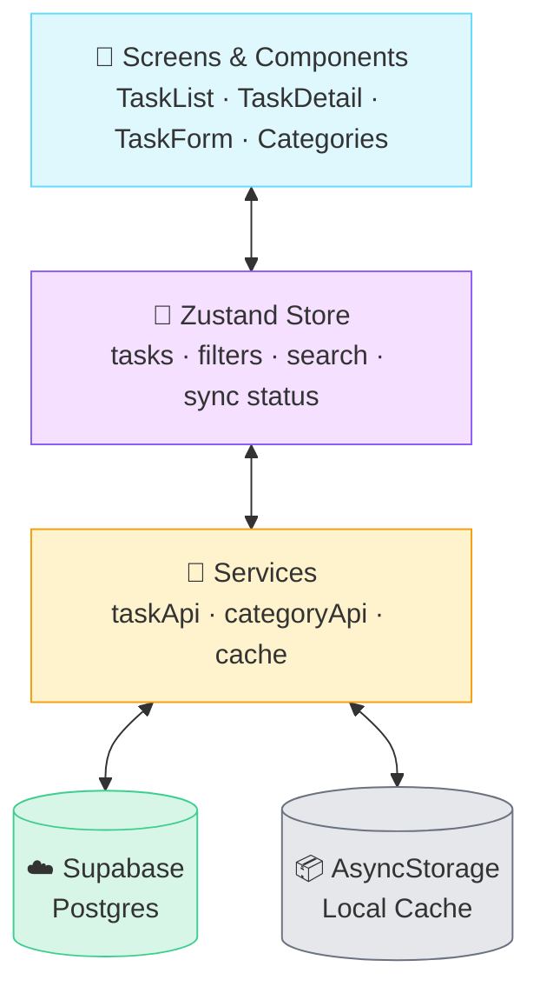
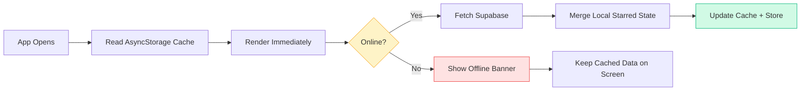
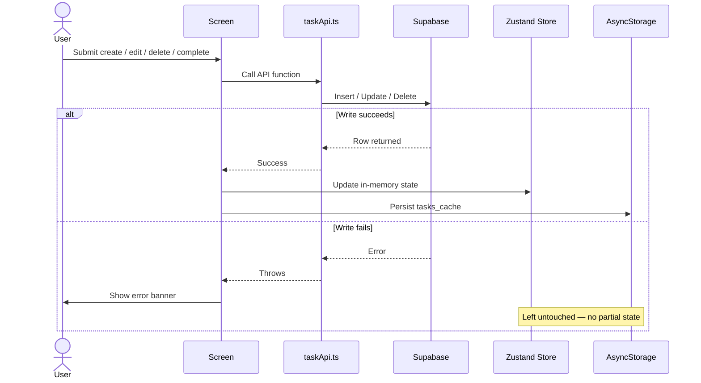

<div align="center">
  

  

  [](https://reactnative.dev/)
  [](https://www.typescriptlang.org/)
  [](https://github.com/pmndrs/zustand)
  [](https://supabase.com/)
  [](https://jestjs.io/)

  <sub>💡 The banner/typing effect above are SVGs from <a href="https://github.com/kyechan99/capsule-render">capsule-render</a> — GitHub strips real <code>&lt;style&gt;</code> animations from README output, this is the standard workaround.</sub>
</div>

---

## 📌 Overview

**TaskManager** is a cross-platform mobile task manager built with **React Native CLI + TypeScript**, engineered around an **offline-first architecture**: the task list always renders from a local cache first, then refreshes from Supabase in the background — with a per-device "starred" flag that's guaranteed to survive every refresh.

Built as a Mid-Level React Native Engineer assessment submission, prioritizing correctness and clean layering over feature breadth.

## ✨ Key Features

- 📝 **Task CRUD** — create, edit, delete, and mark complete/reopen
- 🏷️ **Category Management** — view and add categories, assign them to tasks
- 🔍 **Debounced Search** — 300ms-debounced title search, no per-keystroke filtering
- 🧮 **Filter & Sort** — by category, status (Open/Done), due date, or created time
- 📶 **Offline-First Reads** — cached data renders instantly, before any network call
- 🔄 **Background Sync** — refreshes tasks/categories from Supabase after launch and on pull-to-refresh
- ⭐ **Local-Only Starred Flag** — never touches the backend; preserved across every refresh by design
- 🧱 **Feature-Based Architecture** — UI, state, services, and storage cleanly separated

## 🏗️ Architecture

Three strict layers, one direction of dependency: **Screens → Store → Services → (Supabase / AsyncStorage)**. No screen ever imports Supabase or AsyncStorage directly.



### Offline-First Read Path



The list is **never blank** — cache renders before any network request even starts.

### Write Path (Create / Edit / Delete / Complete)

Writes are **request-first, not optimistic**: the UI only updates after Supabase confirms success, and a failed write leaves the cache completely untouched instead of rolling back a guessed state.



> **How starred survives a refresh:** `mergeTasksWithStarred()` (`src/features/tasks/utils/`) maps every fresh-from-Supabase task through the locally-cached starred map before it ever reaches the store — the server has no `starred` column at all, so there's nothing to overwrite.

## 🛠️ Tech Stack

| Layer | Technology |
|---|---|
| Framework | React Native CLI, TypeScript |
| Navigation | React Navigation (native stack) |
| State | Zustand |
| Backend | Supabase (Postgres) |
| Local Cache | AsyncStorage |
| Connectivity | `@react-native-community/netinfo` |
| Testing | Jest + React Native Testing Library |

## 📁 Folder Structure

```
TaskManager/
├── android/, ios/            Native projects
├── src/
│   ├── app/navigation/       RootNavigator, route param types
│   ├── features/
│   │   ├── tasks/
│   │   │   ├── components/   TaskItem, StarButton, SearchBar, FilterBar...
│   │   │   ├── screens/      TaskListScreen, TaskDetailScreen, TaskFormScreen
│   │   │   ├── hooks/        useDebouncedSearch, useFilteredTasks
│   │   │   ├── utils/        filterTasks, sortTasks, mergeTasksWithStarred
│   │   │   ├── store/        taskStore.ts
│   │   │   └── types/
│   │   └── categories/       screens/ store/ types/
│   ├── sync/
│   │   ├── components/       OfflineBanner, SyncStatusBar
│   │   └── hooks/             useNetworkStatus, useTasksSync
│   ├── services/              supabase.ts, taskApi.ts, categoryApi.ts, cache.ts
│   ├── storage/                asyncStorage.ts, keys.ts
│   ├── theme/                  colors, spacing, typography tokens
│   └── tests/                  4 suites, 31 tests
├── supabase/                  schema.sql, seed.sql
└── .env.example
```

## 🧪 Testing

Jest + React Native Testing Library, **4 suites / 31 tests**, all pure-logic or storage-contract tests (no device/emulator required):

| Suite | Covers |
|---|---|
| `filterAndSort.test.ts` | Category/status filtering, both sort orders, non-mutation |
| `mergeTasksWithStarred.test.ts` | The starred-survives-refresh guarantee |
| `useDebouncedSearch.test.ts` | 300ms debounce timing, via Jest fake timers |
| `cache.test.ts` | AsyncStorage round-trip for the cache layer |

```bash
npm test          # run all suites
npm run typecheck  # tsc --noEmit
npm run lint       # eslint
```

## ⚙️ Installation

```bash
# 1. Clone the repository
git clone <repository-url>
cd TaskManager

# 2. Install dependencies
npm install
cd ios && bundle install && bundle exec pod install && cd ..   # iOS only

# 3. Configure environment variables
cp .env.example .env
# fill in SUPABASE_URL and SUPABASE_ANON_KEY (Supabase → Settings → API)
# then run supabase/schema.sql and supabase/seed.sql in the SQL Editor

# 4. Run Metro (separate terminal)
npx react-native start

# 5. Run the Android app
npm run android
```

## 📦 APK Download

Download the latest Android APK:
**[⬇️ Download TaskManager.apk](https://drive.google.com/file/d/1EA-8K6roAmmKVNADLeZP4mx9Z39PS1p4/view)**

## 📸 Screenshots

| Task List | Task Detail | Create Task |
|:---:|:---:|:---:|
| _coming soon_ | _coming soon_ | _coming soon_ |

## 👨‍💻 Developer Notes

Three judgment calls worth calling out: **AsyncStorage over MMKV/SQLite** — the cached dataset is a few dozen small JSON records, well inside AsyncStorage's comfort zone, and every query already runs in memory rather than against the cache itself. **Zustand over Redux Toolkit or Context** — one feature's worth of state doesn't justify Redux's ceremony, and Context re-renders every consumer on any change unless hand-split. **Request-first writes over optimistic updates** — simpler to reason about and impossible to leave in a half-synced state on failure, at the cost of a small delay before the UI reflects a change. Deeper rationale for each lives as comments directly in `store/` and `services/`.

<div align="center">
  
</div>
